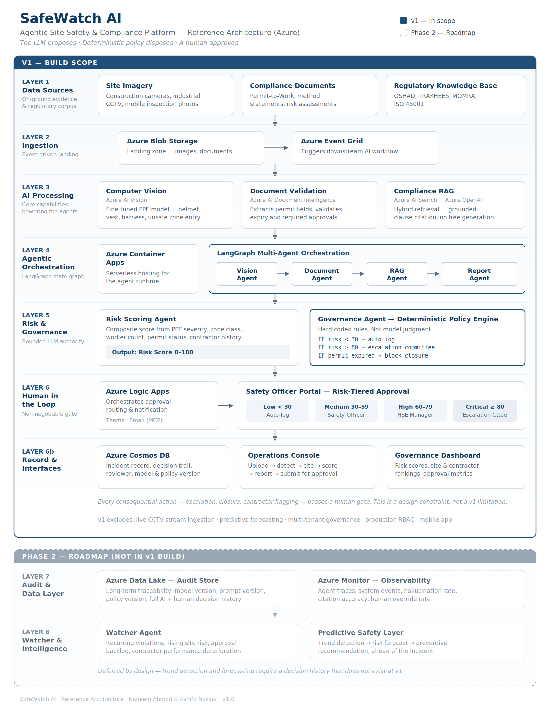

# SafeWatch AI

**Agentic Site Safety & Compliance Platform**

An AI platform that continuously monitors construction and industrial site conditions, validates compliance documentation, cites the governing regulation for every finding, scores risk, and routes decisions to a human safety officer — instead of relying on periodic manual inspection.

Built on Microsoft Azure with LangGraph multi-agent orchestration.

---

## The Problem

Construction and industrial sites across the GCC operate under strict safety regimes — **OSHAD** (Abu Dhabi), **TRAKHEES** (Dubai), **MOMRA** (Saudi Arabia). Compliance today is manual, slow, and reactive: violations are typically discovered *after* an incident, enforcement varies by inspector, and the audit trail behind any given decision is thin.

SafeWatch AI turns that around. Detection is continuous. Every finding is grounded in a cited regulation. Escalation follows deterministic policy, not judgment calls. And every decision — AI-proposed, human-approved — is logged.

---

## Core Principle

> The LLM **proposes**. Deterministic policy **disposes**. A human **approves**.

An LLM is never the final arbiter of a safety escalation. The Governance Agent evaluates hard-coded rules against the risk score, and every consequential action passes a human gate.

---

## Architecture



### Agent Flow

```
Site Image + Permit-to-Work
        │
        ▼
   Vision Agent ──────► PPE violations: helmet / vest / harness / unsafe zone
        │
        ▼
 Document Agent ──────► Permit validity, expiry, required approvals
        │
        ▼
    RAG Agent ────────► Governing regulation + clause + citation
        │
        ▼
Risk Scoring Agent ───► Composite score 0–100
        │
        ▼
Governance Agent ─────► Deterministic policy → routing decision
        │
        ▼
  Human Approval ─────► Approve / Escalate / Reject / Investigate
        │
        ▼
   Incident Record
```

### Layers

| Layer | Purpose | Status |
|---|---|---|
| 1. Data Sources | Site imagery, permits, regulatory corpus | v1 |
| 2. Ingestion | Event-driven landing of unstructured data | v1 |
| 3. AI Processing | Vision, document extraction, regulation retrieval | v1 |
| 4. Agentic Orchestration | LangGraph multi-agent workflow | v1 |
| 5. Risk & Governance | Risk scoring + deterministic policy enforcement | v1 |
| 6. Human in the Loop | Approval, escalation, override | v1 |
| 7. Audit & Data Lake | Long-term traceability and analytics | Phase 2 |
| 8. Watcher & Intelligence | Trend detection, predictive insight | Phase 2 |

---

## Risk-Tiered Approval

| Risk Score | Route |
|---|---|
| < 30 (Low) | Auto-log |
| 30–59 (Medium) | Safety Officer review |
| 60–79 (High) | HSE Manager approval |
| ≥ 80 (Critical) | Escalation committee |

---

## Tech Stack

| Concern | Technology |
|---|---|
| Cloud | Microsoft Azure (UAE North) |
| LLM | Azure OpenAI — GPT-4o |
| Computer Vision | Azure AI Vision / Custom Vision |
| Document extraction | Azure AI Document Intelligence |
| Retrieval | Azure AI Search (hybrid vector + semantic) |
| Orchestration | LangGraph |
| Compute | Azure Container Apps |
| Storage | Blob Storage, Cosmos DB |
| Eventing | Azure Event Grid |
| HITL notification | Azure Logic Apps + Teams/Email (MCP) |
| Dashboard | Power BI Embedded |

---

## Interfaces

**SafeWatch Operations Console** — single-screen workflow for safety officers. Upload evidence → view detections → read cited regulations → see risk score → review AI-drafted incident report → submit for approval.

**SafeWatch Governance Dashboard** — risk visibility, site and contractor rankings, incident trends, approval metrics, and audit posture for HSE and executive leadership.

---

## Scope

### In scope for v1

- PPE violation detection from static site imagery
- Compliance RAG over OSHAD / ISO 45001 regulatory corpus
- Permit-to-work and method statement validation
- Composite risk scoring
- Deterministic governance policy engine
- Human-in-the-loop approval workflow
- Operations Console + Governance Dashboard

### Explicitly out of scope for v1

- Live CCTV stream ingestion
- Predictive risk forecasting
- Multi-site / multi-tenant governance
- Production-grade authentication and RBAC
- Mobile application

> **Note:** This is an architecture demonstrator, not an accredited compliance tool. The regulatory corpus is drawn from publicly available summaries. Do not use for actual regulatory certification.

---

## Roadmap

| Phase | Content |
|---|---|
| **1 — MVP** | PPE detection, Compliance RAG, Document Validation, Risk Scoring, Governance Agent, HITL |
| **2 — Governance Expansion** | Audit data lake, model/prompt/policy versioning |
| **3 — Operational Intelligence** | Watcher Agent, trend analysis, contractor scoring |
| **4 — Predictive Safety** | Risk forecasting, incident probability, preventive recommendations |
| **5 — Enterprise Scale** | Multi-site, multi-tenant governance, executive command centre |

---

## Documentation

- [ADR-001 — Architecture Decision Record](./docs/ADR-001-SafeWatch-AI-Architecture.md)
- [Contributing — ownership, interface contracts, policy rules](./CONTRIBUTING.md)
- [Data sourcing & disclaimers](./data/README.md)

---

## Getting Started

### Prerequisites

- Azure subscription with Azure OpenAI access (GPT-4o)
- Python 3.11+
- Azure CLI
- Node.js 20+ (for the UI)

### Local development

```bash
git clone https://github.com/<org>/safewatch-ai.git
cd safewatch-ai

python -m venv .venv
source .venv/bin/activate        # Windows: .venv\Scripts\activate
pip install -r requirements.txt

cp .env.example .env             # then fill in your Azure credentials
```

### Repository structure

```
safewatch-ai/
├── docs/          Architecture diagram + ADR
├── src/
│   ├── agents/       LangGraph orchestration
│   ├── vision/       PPE detection
│   ├── document/     Permit validation
│   ├── rag/          Compliance retrieval
│   ├── governance/   Risk scoring + policy engine
│   └── api/          FastAPI layer + HITL
├── ui/
│   ├── operations-console/
│   └── governance-dashboard/
├── infra/         Azure IaC
├── data/          Sample data (gitignored)
└── tests/
```

### Quality gates

```bash
ruff check src/ && ruff format src/ && mypy src/ && pytest
```

---

## Team

| | |
|---|---|
| **Nadeem Ahmad** | LangGraph orchestration, Compliance RAG, Risk Scoring & Governance agents, Azure infrastructure |
| **Ashifa Nassar** | Computer Vision / PPE detection, Document Validation, Operations Console & Governance Dashboard |

---

## Licence

TBD
